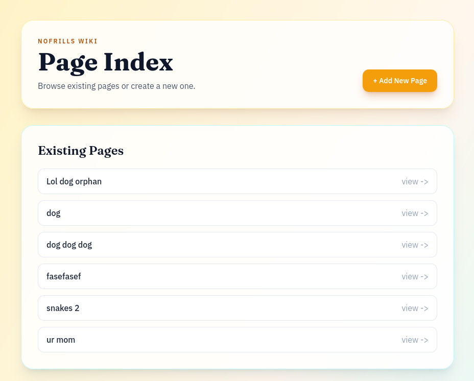
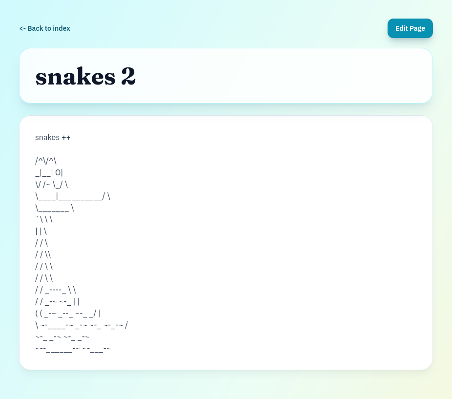

# simple-wiki-go
its a simple wiki written in go for my education

## resources
https://go.dev/doc/articles/wiki/

## screenshots

## project layout
Standardized Go app layout:

- `cmd/wiki/`: application entrypoint
- `internal/wiki/`: application logic (handlers, storage helpers, template helpers)
- `web/templates/`: HTML templates
- `web/static/`: static assets
- `data/pages/`: file-backed page content (gitignored)

## archival notes
Repository activity appears to be concentrated on February 8, 2024 (UTC-06:00).

### timeline
1. 2024-02-08 03:20:49 -0600 (`ba3bd10`) - Initial commit
   - Added `.gitignore`, `LICENSE`, and `README.md`.
2. 2024-02-08 05:29:35 -0600 (`c92b37f`) - has bugs
   - Built the first working version of the wiki app:
   - Added Go module, handlers, templates, I/O utilities, and sample pages.
3. 2024-02-08 21:48:55 -0600 (`e016f85`) - works now
   - Bug-fix pass:
   - Updated handlers/templates and removed sample page files.
   - Added `bugs.txt` and updated `.gitignore`.
4. 2024-02-08 22:40:51 -0600 (`f54fbfd`) - nnnnice
   - Polish pass:
   - Added stylesheet and utility helpers.
   - Improved template rendering and page/title behavior.
   - Updated `bugs.txt` with fixes.

### status at archival time
- No uncommitted changes in working tree (`git status` clean).
- No commits after 2024-02-08 22:40:51 -0600.
